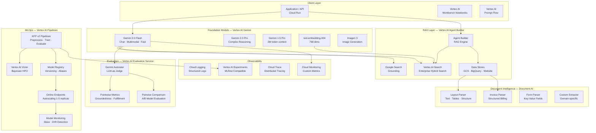
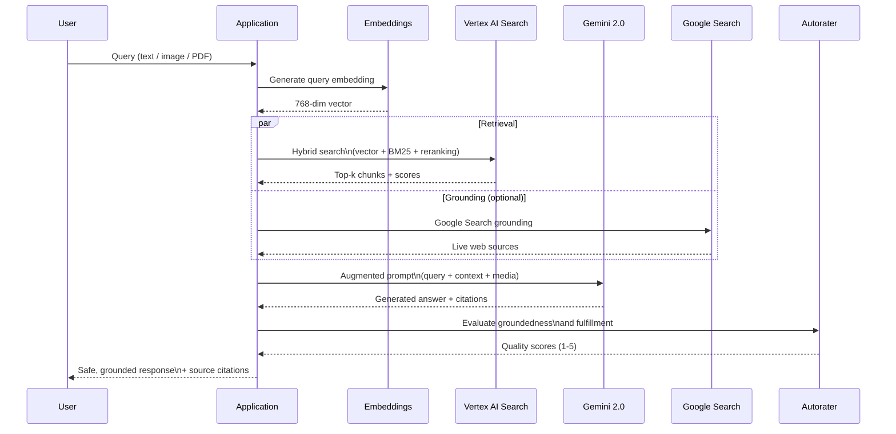
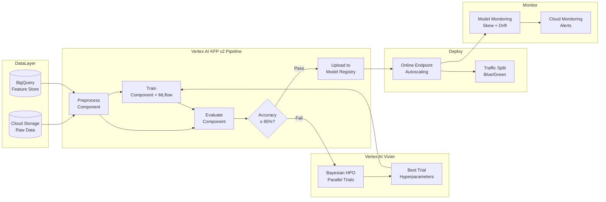
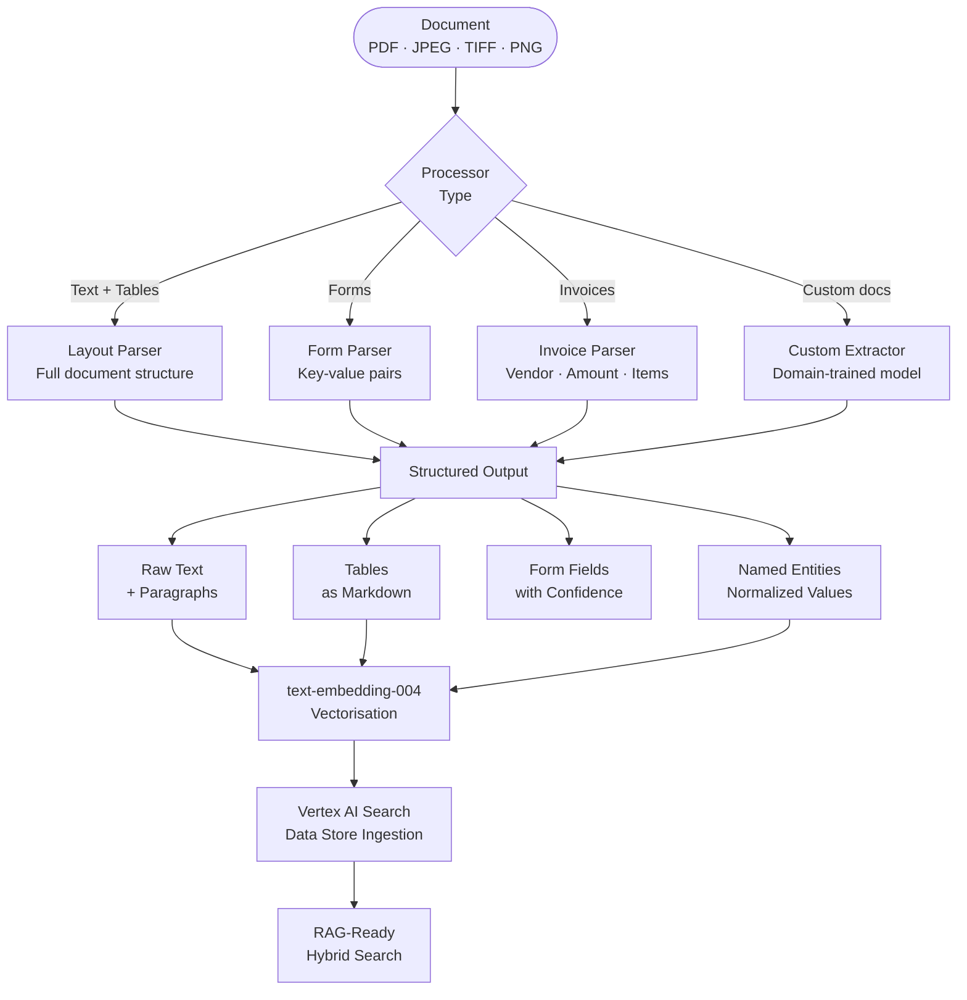
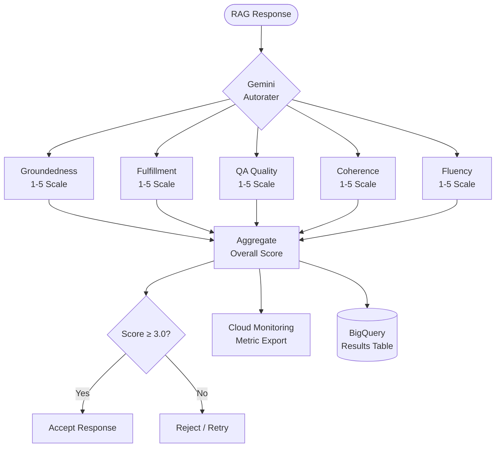

# Google AI Platform Engineering


**Author:** Ramy Amer  
**Region:** australia-southeast1 | **Python:** 3.12 | **Packaging:** pyproject.toml (Hatchling)

---

A production-grade reference implementation covering the full breadth of the Google Cloud AI and machine learning platform. Every component is built to production standards — typed, tested, observable, integrated with Cloud Monitoring, and wired through a single configuration file. This is the architecture you deploy when Gemini's multi-modal capabilities, Vertex AI's enterprise MLOps, and Google's search infrastructure need to work together at scale.

---

## Table of Contents

- [Architecture Overview](#architecture-overview)
- [Components](#components)
  - [Vertex AI Gemini — Foundation Models](#vertex-ai-gemini--foundation-models)
  - [Vertex AI Agent Builder — RAG](#vertex-ai-agent-builder--rag)
  - [Vertex AI Pipelines — MLOps](#vertex-ai-pipelines--mlops)
  - [Google Cloud Document AI](#google-cloud-document-ai)
  - [Vertex AI Evaluation Service](#vertex-ai-evaluation-service)
  - [BigQuery ML Integration](#bigquery-ml-integration)
- [Project Structure](#project-structure)
- [Prerequisites](#prerequisites)
- [Deployment Guide](#deployment-guide)
- [Configuration Reference](#configuration-reference)
- [Cost Estimates](#cost-estimates)
- [Troubleshooting](#troubleshooting)

---

## Architecture Overview

### Full Platform Architecture



### Gemini Multi-modal RAG Pipeline



### Vertex AI KFP Pipeline — MLOps Flow



### Document AI Processing Pipeline



### Vertex AI Evaluation — LLM-as-Judge



---

## Components

### Vertex AI Gemini — Foundation Models

**Location:** `src/models/gemini_client.py`

Unified client across all Gemini model variants with streaming, multi-modal (image/video/audio/PDF), Google Search grounding, function calling, and structured JSON output.

**Supported models:**

| Config Key | Model | Best For |
|-----------|-------|---------|
| `gemini_2_flash` | Gemini 2.0 Flash | Fast, cost-efficient, multimodal |
| `gemini_2_pro` | Gemini 2.0 Pro | Complex reasoning, agentic tasks |
| `gemini_15_pro` | Gemini 1.5 Pro | 2M token context, long documents |
| `gemini_15_flash` | Gemini 1.5 Flash | Balanced speed and capability |
| `text_embed_004` | text-embedding-004 | 768-dim embeddings for RAG |
| `imagen_3` | Imagen 3 | High-quality image generation |

**Usage:**
```python
from src.models.gemini_client import GeminiClient

client = GeminiClient(model_key="gemini_2_flash")

# Text generation
result = client.generate("Explain Vertex AI Agent Builder in three sentences.")
print(f"{result.text}\nCost: ${result.estimated_cost_usd:.4f}")

# Streaming
for chunk in client.generate_stream("Write a summary of GCP AI services"):
    print(chunk, end="", flush=True)

# Multi-modal — image, PDF, video
result = client.generate_with_media(
    "Describe the architecture in this diagram and identify cost optimisation opportunities.",
    media_paths=[Path("architecture.png")],
    system="You are a GCP solutions architect.",
)

# Grounded generation with live Google Search
result = client.generate_grounded(
    "What are the latest Gemini 2.0 capabilities announced at Google Cloud Next?",
    use_google_search=True,
)
for source in result.grounding_chunks:
    print(f"Source: {source['title']} — {source['uri']}")

# Structured JSON output
data = client.json_output(
    "Extract all invoice fields from this text: ...",
    response_schema={"type": "object", "properties": {"vendor": {"type": "string"}, "total": {"type": "number"}}},
)

# Embeddings
emb = client.embed("Vertex AI provides a unified ML platform", task_type="RETRIEVAL_QUERY")
print(f"Dimensions: {emb.dimensions}")  # 768
```

---

### Vertex AI Agent Builder — RAG

**Location:** `src/rag/agent_builder_client.py`

Enterprise search and grounded RAG over documents, websites, and BigQuery data with managed retrieval and answer generation.

**Usage:**
```python
from src.rag.agent_builder_client import AgentBuilderClient

ab = AgentBuilderClient()

# Search documents
hits = ab.search("What are our APRA CPS 234 obligations?", top_k=10)
for hit in hits:
    print(f"[{hit.score:.3f}] {hit.title}: {hit.snippet[:100]}")

# Grounded RAG answer with citations
answer = ab.answer_query(
    "Summarise our data classification policy and residency requirements",
)
print(answer.format_with_citations())

# Multi-turn conversation
session_id = answer.session_id
follow_up = ab.answer_query(
    "What are the penalties for non-compliance?",
    session_id=session_id,
)

# Ingest documents from GCS
op_name = ab.ingest_documents_gcs("gs://my-bucket/documents/")
```

---

### Vertex AI Pipelines — MLOps

**Location:** `src/pipelines/vertex_pipeline.py`

KFP v2 pipelines with component caching, model registry, autoscaling endpoints, and drift monitoring.

**Usage:**
```python
from src.pipelines.vertex_pipeline import VertexPipelineOrchestrator

orchestrator = VertexPipelineOrchestrator()

# Submit training pipeline
result = orchestrator.submit_training_pipeline(
    experiment_name="churn-prediction-v4",
    training_data_gcs="gs://bucket/data/churn.csv",
    hyperparameters={"n_estimators": 150, "max_depth": 8, "learning_rate": 0.05},
)

# Wait for completion
final = orchestrator.wait_for_pipeline(result.pipeline_job_name)
if final.succeeded:
    model = orchestrator.upload_model(
        model_gcs_uri="gs://bucket/models/churn-v4/",
        display_name="churn-classifier-v4",
    )
    endpoint = orchestrator.deploy_model(
        model_resource_name=model.resource_name,
        min_replicas=1,
        max_replicas=5,
    )
    print(f"Endpoint: {endpoint.predict_uri}")

# Set up monitoring
orchestrator.setup_model_monitoring(
    endpoint_resource_name=endpoint.endpoint_resource_name,
    training_dataset_gcs="gs://bucket/data/churn.csv",
    target_field="churned",
    skew_threshold=0.3,
    drift_threshold=0.3,
)
```

---

### Google Cloud Document AI

**Location:** `src/document_intelligence/document_ai_client.py`

Layout, form, invoice, and custom model processing with structured extraction and batch GCS processing.

**Usage:**
```python
from pathlib import Path
from src.document_intelligence.document_ai_client import DocumentAIClient

doc_ai = DocumentAIClient()

# Invoice extraction
result = doc_ai.process_document(Path("invoice.pdf"), processor_key="invoice_parser")
entities = result.get_entity("total_amount")
print(f"Invoice total: {entities}")
print(result.tables_as_markdown())

# Layout analysis
layout = doc_ai.process_document(Path("contract.pdf"), processor_key="layout_parser")
print(layout.raw_text)
for field in layout.form_fields:
    if field.is_confident:
        print(f"{field.name}: {field.value} ({field.confidence:.2f})")

# Batch GCS processing
op_name = doc_ai.batch_process_gcs(
    gcs_input_uri="gs://bucket/invoices/",
    gcs_output_uri="gs://bucket/processed/",
    processor_key="invoice_parser",
)
doc_ai.wait_for_batch(op_name)
```

---

### Vertex AI Evaluation Service

**Location:** `src/evaluation/vertex_evaluation.py`

LLM-as-judge evaluation with Gemini autorater: groundedness, fulfillment, QA quality, coherence, fluency, plus pairwise A/B comparison and Cloud Monitoring export.

**Usage:**
```python
from src.evaluation.vertex_evaluation import VertexAIEvaluator

evaluator = VertexAIEvaluator()

# Pointwise evaluation
result = evaluator.evaluate_pointwise(
    question="What is our cloud storage data residency policy?",
    response=rag_answer,
    context="\n".join(chunk.content for chunk in retrieved_chunks),
    reference="All data must remain in australia-southeast1 per policy 3.2.",
)
print(f"Groundedness:  {result.groundedness}/5")
print(f"Fulfillment:   {result.fulfillment}/5")
print(f"QA Quality:    {result.question_answering_quality}/5")
print(f"Overall:       {result.overall_score:.1f}/5")

# Pairwise A/B comparison
comparison = evaluator.evaluate_pairwise(
    question="Explain APRA CPS 234 requirements",
    response_a=gemini_flash_response,
    response_b=gemini_pro_response,
)
print(f"Winner: {comparison.winner}")  # "A", "B", or "SAME"

# Batch evaluation with Cloud Monitoring export
summary = evaluator.evaluate_batch(
    test_cases, publish_to_monitoring=True, export_to_bigquery=True,
    bq_table="project.dataset.eval_results"
)
print(f"Pass rate: {summary.pass_rate:.1%}")
```

---

## Project Structure

```
google-ai-platform-engineering/
├── config/
│   └── gcp_config.yaml                     # ← Wire all GCP resources here
│
├── src/
│   ├── models/
│   │   └── gemini_client.py                # Gemini: text, stream, multimodal, grounding, tools
│   ├── rag/
│   │   └── agent_builder_client.py         # Agent Builder: search, RAG, ingestion
│   ├── pipelines/
│   │   └── vertex_pipeline.py              # KFP v2: pipeline, registry, endpoints, monitoring
│   ├── document_intelligence/
│   │   └── document_ai_client.py           # Document AI: layout, invoice, form, batch
│   ├── evaluation/
│   │   └── vertex_evaluation.py            # Evaluation: pointwise, pairwise, batch, BQ export
│   └── utils/
│       ├── config.py                       # Config loader with env var substitution
│       └── logging.py                      # Structured logging + Cloud Logging integration
│
├── notebooks/
│   ├── 01_gemini_text_and_multimodal.ipynb
│   ├── 02_vertex_rag_agent_builder.ipynb
│   ├── 03_grounded_generation.ipynb
│   ├── 04_document_ai_pipeline.ipynb
│   ├── 05_vertex_ai_pipelines_mlops.ipynb
│   ├── 06_model_evaluation_service.ipynb
│   └── 07_bigquery_ml_gemini.ipynb
│
├── tests/
│   ├── unit/
│   │   ├── test_gemini_client.py
│   │   └── test_agent_builder_client.py
│   └── integration/
│
├── infrastructure/
│   ├── terraform/                          # Terraform GCP IaC
│   └── deployment_manager/                 # GCP Deployment Manager templates
│
├── scripts/
│   ├── preprocess.py                       # KFP preprocessing component
│   ├── train.py                            # KFP training component
│   └── evaluate.py                         # KFP evaluation component
│
├── docs/
│   └── architecture.md
│
├── pyproject.toml
├── .gitignore
└── LICENSE
```

---

## Prerequisites

### GCP APIs to Enable

```bash
gcloud services enable \
  aiplatform.googleapis.com \
  discoveryengine.googleapis.com \
  documentai.googleapis.com \
  dialogflow.googleapis.com \
  bigquery.googleapis.com \
  storage.googleapis.com \
  logging.googleapis.com \
  monitoring.googleapis.com \
  cloudtrace.googleapis.com \
  secretmanager.googleapis.com \
  run.googleapis.com \
  --project=${GCP_PROJECT_ID}
```

### Required IAM Roles

```bash
# Vertex AI User
gcloud projects add-iam-policy-binding ${GCP_PROJECT_ID} \
  --member="serviceAccount:${SA_EMAIL}" \
  --role="roles/aiplatform.user"

# Discovery Engine Viewer (Agent Builder)
gcloud projects add-iam-policy-binding ${GCP_PROJECT_ID} \
  --member="serviceAccount:${SA_EMAIL}" \
  --role="roles/discoveryengine.viewer"

# Document AI Editor
gcloud projects add-iam-policy-binding ${GCP_PROJECT_ID} \
  --member="serviceAccount:${SA_EMAIL}" \
  --role="roles/documentai.editor"

# BigQuery Data Editor
gcloud projects add-iam-policy-binding ${GCP_PROJECT_ID} \
  --member="serviceAccount:${SA_EMAIL}" \
  --role="roles/bigquery.dataEditor"

# Storage Object Admin
gcloud projects add-iam-policy-binding ${GCP_PROJECT_ID} \
  --member="serviceAccount:${SA_EMAIL}" \
  --role="roles/storage.objectAdmin"
```

---

## Deployment Guide

### Step 1 — Clone and Install

```bash
git clone https://github.com/romeosd/google-ai-platform-engineering.git
cd google-ai-platform-engineering

python3.12 -m venv .venv
source .venv/bin/activate

pip install -e ".[dev,notebooks]"
```

### Step 2 — Authenticate to GCP

```bash
# Application Default Credentials (local dev)
gcloud auth application-default login

# Service Account (production)
export GOOGLE_APPLICATION_CREDENTIALS=/path/to/service-account-key.json

# On GCE/Cloud Run — automatic via metadata server
```

### Step 3 — Configure gcp_config.yaml

```bash
export GCP_PROJECT_ID=your-project-id
export VERTEX_STAGING_BUCKET=gs://your-bucket/staging
export VERTEX_PIPELINE_ROOT=gs://your-bucket/pipeline-root
export VERTEX_SA_EMAIL=your-sa@your-project.iam.gserviceaccount.com
export AGENT_BUILDER_SEARCH_APP_ID=your-search-app-id
export AGENT_BUILDER_DATASTORE_ID=your-datastore-id
export GCS_RAW_DATA_BUCKET=your-raw-data-bucket
```

### Step 4 — Create GCS Buckets and Vertex AI Resources

```bash
# Create buckets
gsutil mb -l australia-southeast1 gs://${GCP_PROJECT_ID}-ai-platform-staging
gsutil mb -l australia-southeast1 gs://${GCP_PROJECT_ID}-ai-platform-data

# Create Vertex AI Agent Builder app via Console:
# Vertex AI → Agent Builder → New App → Search → Connect data stores
```

### Step 5 — Run Tests

```bash
pytest tests/unit/ -v
pytest --cov=src --cov-report=html
```

### Step 6 — Deploy Infrastructure

```bash
cd infrastructure/terraform
terraform init
terraform plan -var="project_id=${GCP_PROJECT_ID}" -var="region=australia-southeast1"
terraform apply
```

---

## Configuration Reference

| Section | Key | Description |
|---------|-----|-------------|
| `gcp.project_id` | — | Your GCP project ID |
| `gcp.region` | — | Primary region (australia-southeast1) |
| `vertex_ai.models` | `gemini_2_flash` | Vertex AI model name for Gemini 2.0 Flash |
| `vertex_ai.inference` | `temperature` | Default temperature (0.1) |
| `agent_builder.apps` | `search_app_id` | Your Agent Builder search app ID |
| `vertex_pipelines.pipeline_root` | — | GCS URI for pipeline artifacts |
| `document_ai.processors` | `layout_parser` | Document AI processor ID |
| `bigquery.dataset_id` | — | BigQuery dataset for ML models |

---

## Cost Estimates

Approximate costs for `australia-southeast1` (USD).

| Component | Workload | Estimated Cost |
|-----------|---------|---------------|
| Gemini 2.0 Flash | 1M input + 200K output tokens/day | ~$0.075 input + $0.06 output |
| Gemini 2.0 Pro | 500K input + 100K output tokens/day | ~$0.625 input + $0.50 output |
| text-embedding-004 | 10M tokens/month | ~$0.10/month |
| Vertex AI Search | 10K queries/month | ~$3/month |
| Vertex AI Pipelines | ml.p3.2xlarge-equiv × 1hr | ~$0.90/run |
| Online Endpoint | n1-standard-4 · 24/7 | ~$110/month |
| Document AI | Layout parser · 1K pages | ~$1.50/month |
| Agent Builder | 1M search queries/month | ~$30/month |

---

## Troubleshooting

### PermissionDenied — Vertex AI

```
google.api_core.exceptions.PermissionDenied: 403 Permission denied on resource project
```

Ensure the Vertex AI API is enabled and the service account has `roles/aiplatform.user`.

### Agent Builder: INVALID_ARGUMENT

The `search_app_id` in config must match exactly what was created in the GCP Console under Vertex AI → Agent Builder. The ID is case-sensitive.

### Document AI: Processor not found

Document AI processors are regional. The `location` in config must match where you created the processor (`us` or `eu` only — Document AI is not yet available in `australia-southeast1`).

### KFP Pipeline: pipeline_root not found

The `VERTEX_PIPELINE_ROOT` GCS bucket must exist before submitting pipelines:
```bash
gsutil mb -l australia-southeast1 gs://your-bucket/pipeline-root
```

### Gemini: RESOURCE_EXHAUSTED

You've hit Gemini API quota limits. Request quota increases via GCP Console → IAM & Admin → Quotas → `aiplatform.googleapis.com`. For high-throughput production, use batch prediction instead of online generation.

---

## Architecture Decisions

See [`docs/architecture.md`](docs/architecture.md) for decisions covering:

- Vertex AI Agent Builder vs self-managed RAG with AlloyDB
- text-embedding-004 vs gecko for enterprise RAG
- KFP v2 vs Dataflow for large-scale ML pipelines
- Document AI vs Vision API for structured document extraction
- Vertex AI Evaluation vs custom LLM-as-judge

---

*Built by Ramy Amer — Google AI Platform Engineering | australia-southeast1*
